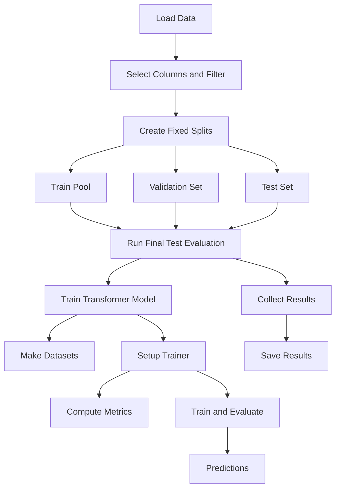

## targettype.ipynb

1. The `create_fixed_splits()` function was missing a random state parameter. Added it. Need to check other classification models for the same. 
2. The `stratified_split()` function is incredibly confusing in terms of the order of the splits. I've added comments to explain the order of the splits in `targettype.ipynb` and we should check other classification models for the same. Cursor is saying that the correct order is not being used in some of the older files, e.g. `civ_targettype.ipynb` and `actiontype_old.ipynb`. 
3. Deleted `stratify_cols` as an argument for the experiments (`run_final_test_evaluation()`) function. `stratify_cols` is relevant for creating the splits, but not for running the experiments. Check other classification models for the same. 
4. Added a random state parameter to the experiments(`fun_final_test_evaluation()`) function. 
5. Added a docstring to the MultiLabelDataset class. 
6. Eliminated reference to `run_validation_experiments()` in the docstring for `run_final_test_evaluation()`. 
7. Renamed `run_final_test_evaluation()` to `run_model_experiments()`. 

## actiontype.ipynb

1. Added a random state parameter to the `create_fixed_splits()` function. 
2. Added comments to the `stratified_split()` function to explain the order of the splits. 
3. Deleted `stratify_cols` as an argument for the experiments (`run_final_test_evaluation()`) function `stratify_cols` is relevant for creating the splits, but not for running the experiments. 
4. Added a random state parameter to the experiments(`fun_final_test_evaluation()`) function.
5. Added a docstring to the MultiLabelDataset class.  
6. Eliminated reference to `run_validation_experiments()` in the docstring for `run_final_test_evaluation()`. 
7. Renamed `run_final_test_evaluation()` to `run_model_experiments()`. 
   
## Other issues

1. What are `civ_targettype.ipynb` and `actiontype_old.ipynb`? Do we still need them? 
2. Consider adding a README with a diagram explaining the flow of the code. (See below for potential mermaid diagram).
3. Do we really need to notebooks for the targettype and actiontype models? Can we just use the `run_model_experiments()` function? Should we combine as a single notebook? Or should we have one script that runs the models and import it into the notebooks that then analyze the two models separately? 

## Potential diagram for the targettype model (or other multi-label classification models))

