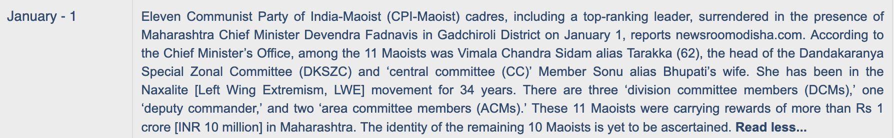

```{r}
#| label: setup
#| include: false

# Load necessary packages
library(ggplot2)
library(dplyr)
library(tidyr)
library(pROC)
library(knitr)
library(viridis)
library(readr)
library(here) 
library(janitor)
library(patchwork)

# Declare location of presentation
here::i_am("presentation.qmd")

# Load custom functions
source("data-viz/model_performance_plots.R")
source("data-viz/heatmap_plots.R")
source("data-viz/support_plots.R")
source("data-viz/scatter_plots.R")
source("data-viz/bootstrap_multiclass_macro_f1_plot.R")
source("data-viz/bootstrap_multiclass_weighted_f1_plot.R")
source("data-viz/bootstrap_multilabel_f1_plot.R")
source("data-viz/imbalance_strategy_heatmap.R")
source("data-viz/rare_labels_pr_plots.R")

# Load and mildly wrangle summary data
perpetrator_summary <- read_csv("results/perpetrator_summary.csv") |>
  clean_names()
action_type_summary <- read_csv("results/actiontype_test1_summary.csv") |>
  clean_names() 
target_type_summary <- read_csv("results/targettype_test1_summary.csv") |>
  clean_names()

# Load predictions
perpetrator_pred <- read_csv("results/perpetrator_predictions.csv")
action_type_pred <- read_csv("results/actiontype_test1_predictions.csv") 
target_type_pred <- read_csv("results/targettype_test1_predictions.csv")

# Load data for imbalance handling strategies
imbalance_f1 <- read_csv("results/target-type_strategy_f1_long.csv")
target_predictions <- read_csv("results/target-type_strategy_predictions.csv") 
```

## Overview

- Focus: Maoist insurgency in India 
- Data set of 10k hand-coded events from SATP over 2005-2016
- Charactersitic of bespoke datasets with niche labels and lexical complexity that we find in regional and conflict studies
- Wanted to see how much we could autocode with fine tuned, low-cost, open source encoder models (e.g. BERT)

## Data: South Asia Terrorism Portal (SATP)

- Focus: Maoist insurgency in India
- 10,000 hand-coded event summaries



## Protocols for Human Codings

- Grad student supervisor
- 4-6 undergrads coding in pairs
- Structured onboarding
- Supervised trials
- Events double-coded
- Regular meetings to adjudicate edge cases
- Discrepancies resolved by senior coders


## Classification Tasks

- **Perpetrator/Action Taker**--Maoist, security, other
- **Action Type**--Armed assault, arrest, abduction, bombing, infrastructure (sabotage), seizure/raid, surrender
- **Target Type**--Maoist, civilians, security, govt. facility/infrastructure, property, officials, mining co., other armed group, no target

## Models Compared {.smaller}

- **BERT:** 12-layer, 110M; masked language modeling
- **DistilBERT:** 6-layer, 66M; faster, lighter BERT
- **RoBERTa:** 12-layer, 125M; more data, no NSP
- **ELECTRA:** 12-layer, 110M; replaced token detection
- **XLNet:** 12-layer, 110M; permutation-based autoregressive model
- **ConfliBERT:** Domain-specific BERT for political conflict

<br>
*When there was a choice, we used the cased versions of these models. For ConfliBERT, we used scr-cased.*

## Research Questions

- To what extent can encoder models replace humans at our coding tasks?
- How many examples do you need for accurate codings? 
- How do encoders trade off in terms of speed and accuracy? 
- How best to deal with rare labels? 

## Modeling Strategy

- **Perpetrator Type**: Multiclass classification  
- **Action Type** & **Target Type**: Multilabel classification  
- Models evaluated using **fixed validation and test sets** (~1,000 records each) with stratified sampling across labels
- Focused on:
  - **Weighted F1** for multiclass
  - **Micro F1** for multilabel

## Training Strategy

- Remaining data used for training  
- We evaluate model performance at increasing training sizes:
  - 1/32, 1/16, 1/8, 1/4, 1/2, and full training set
- Allows us to observe performance trends as data scales  
- For each iteration, one random seed to select stratified samples from the training set

##

```{r}
#| label: perpetrator
#| fit-align: center

line_chart <- model_performance_plot(
  data = perpetrator_summary,
  xvar = fraction_raw,
  yvar = eval_f1_weighted,
  color = model_label,
  title = "a. F1 vs. Training Data Fraction",
  ytitle = "Weighted F1 Score",
  palette = "turbo",
  end = .8
)

f1_ci_plot <- bootstrap_multiclass_weighted_f1_plot(perpetrator_pred,
                             fraction_value = "25%",
                             title = "b. CIs at 25% Training",
                             color = "#8337A0",
                             n_boot = params$reps)

combined_plot <- line_chart + f1_ci_plot + 
  plot_layout(widths = c(2, 1)) + 
  plot_annotation(
    title = "Model Performance for 'Perpetrator' Task",
    theme = theme(plot.title = element_text(hjust = 0.5, face = "bold")),
    caption = "95% confidence intervals for macro F1 scores calculated via bootstrap resampling."
  )

combined_plot
```

## 

```{r}
#| label: action_type_performance
#| fig-align: left

line_chart <- model_performance_plot(
  data = action_type_summary,
  xvar = fraction_raw,
  yvar = test_micro_avg_f1_score,
  color = model_label,
  title = "a. F1 vs. Training Data Fraction",
  ytitle = "Micro F1 Score",
  palette = "turbo",
  end = .8
)

f1_ci_plot <- bootstrap_multilabel_f1_plot(action_type_pred,
                             fraction_value = "25.0%",
                             title = "b. CIs at 25% Training",
                             ytitle = NULL,
                             color = "#8337A0",
                             n_boot = params$reps)

combined_plot <- line_chart + f1_ci_plot + 
  plot_layout(widths = c(2, 1)) +
  plot_annotation(
    title = "Model Performance for 'Action Type' Task",
    theme = theme(plot.title = element_text(hjust = 0.5, face = "bold")),
    caption = "95% confidence intervals for micro F1 scores calculated via bootstrap resampling."
  )

combined_plot
```

## 

```{r}
#| label: action_type_labels
#| fig-align: center

library(patchwork)

# Generate the heatmap and store the object
heatmap <- per_label_f1_heatmap(action_type_summary)

# Extract the label order used in the heatmap
label_order <- levels(heatmap$data$label)

# Generate the support bar plot using the same label order
barplot <- per_label_support_barplot(action_type_summary, label_levels = label_order) + 
  theme(axis.text.x = element_text(size = 8))

# Combine with patchwork
combined_plot <- barplot + heatmap +
  plot_layout(widths = c(1, 3)) +
  plot_annotation(
    title = "Model Performance and Test Set Support by 'Action Type' Label",
    theme = theme(plot.title = element_text(hjust = 0.5, face = "bold")),
    #caption = "Barplot shows the number of samples per label in the test set. Heatmap shows the F1 score for each model and label."
  )

combined_plot
```

##

```{r}
#| label: target_type_performance
#| fig-align: center

line_chart <- model_performance_plot(
  data = target_type_summary,
  xvar = fraction_raw,
  yvar = test_micro_avg_f1_score,
  color = model_label,
  title = "a. F1 vs. Training Data Fraction",
  ytitle = "Micro F1 Score",
  palette = "turbo",
  end = .8
)

f1_ci_plot <- bootstrap_multilabel_f1_plot(target_type_pred,
                             fraction_value = "25.0%",
                             title = "b. CIs at 25% Training",
                             color = "#8337A0",
                             n_boot = params$reps)

combined_plot <- line_chart + f1_ci_plot + 
  plot_layout(widths = c(2, 1)) +
  plot_annotation(
    title = "Model Performance for 'Target Type' Task",
    theme = theme(plot.title = element_text(hjust = 0.5, face = "bold")),
    caption = "95% confidence intervals for micro F1 scores calculated via bootstrap resampling."
  )

combined_plot
```

##

```{r}
#| label: target_type_labels
#| fig-align: center

library(patchwork)

# Create shorter axis labels
short_labels = c("Maoist", "No Target", "Security", "Civilians", "Infrastructure", "Property", "Officials", "Mining Co.", "Other Group")

# Generate the heatmap and store the object
heatmap <- per_label_f1_heatmap(target_type_summary) + scale_x_discrete(labels = short_labels)

# Extract the label order used in the heatmap
label_order <- levels(heatmap$data$label) 

# Generate the support bar plot using the same label order
barplot <- per_label_support_barplot(target_type_summary, label_levels = label_order) +
  scale_x_discrete(labels = short_labels) +
  theme(axis.text.x = element_text(size = 8))

# Combine with patchwork
combined_plot <- barplot + heatmap +
  plot_layout(widths = c(1, 3)) +
  plot_annotation(
    title = "Model Performance and Test Set Support by 'Target Type' Label",
    theme = theme(plot.title = element_text(hjust = 0.5, face = "bold")),
    #caption = "Barplot shows the number of samples per label in the test set. Heatmap shows the F1 score for each model and label."
  )

combined_plot
```


## Handling Imbalanced Labels

- **Threshold Tuning** -- Adjust decision cutoffs
- **Class Weights** -- Penalize majority class errors  
- **Weighted Sampling** -- Oversample minority classes
- **Focal Loss** -- Focus learning on difficult/rare examples
- **Back Translation** -- Synthetic data via translation
- **T5 Augmentation** -- Synthetic examples using T5 model

##

```{r}
#| label: imbalance-handling-heatmap
#| fig-align: center

# Create shorter x-axis labels
short_labels = c("Maoist", "No Target", "Security", "Civilians", "Officials", "Infrastructure", "Property", "Other Group", "Mining Co.")

# Generate the heatmap and store the object
imbalance_strategy_heatmap(imbalance_f1) + 
  scale_x_discrete(labels = short_labels) +
  plot_annotation(
    title = "Performance of Six Imbalance Handling Strategies",
    #caption = "The size of the points indicates the fraction of data used for training.",
    theme = theme(
      plot.title = element_text(hjust = 0.5, face = "bold"),  
      plot.caption = element_text(margin = margin(t = 10))
    )
  )
```

## Precision-Recall Tradeoffs

- **High-Precision Approaches:** Minimize false positives (reduces analyst workload but risks missing true events)
- **High-Recall Approaches:** Prioritize comprehensive event capture for monitoring applications where missing critical incidents carries high costs
- **Balanced Strategies**: Optimize for general-purpose classification when both false positives and false negatives impose significant operational costs

## 

```{r}
#| label: PR plots
#| fig-align: center

taskname <- "target_type"
rare_labels <- c('government_infrastructure', 'private_property', 
                 'non_maoist_armed_group', 'mining_company')

create_rare_labels_comparison_plots(
    target_predictions,
    taskname,
    rare_labels
  ) +
  plot_annotation(
    title = "Precision-Recall Plots for Imbalance Handling Strategies",
    #caption = "The size of the points indicates the fraction of data used for training.",
    theme = theme(
      plot.title = element_text(hjust = 0.5, face = "bold"),  
      plot.caption = element_text(margin = margin(t = 10))
    )
  )
```

##

```{r}
#| label: performance_vs_speed
#| fig-align: center

library(grid)

action_scatter <- scatter_plot_speed_vs_accuracy(
  data = action_type_summary,
  xcol = test_samples_per_second,
  ycol = test_micro_avg_f1_score,
  color = model_label,
  size = fraction_raw,
  title = "Action Type"
) + 
  xlab(NULL) + 
  theme(
    legend.position = "none",
    panel.border = element_rect(color = "gray80", fill = NA, linewidth = 0.5),
    panel.background = element_blank()
  ) +
  scale_size_continuous(
    range = c(2, 7),
    breaks = c(0.03125, 0.0625, 0.25, 0.50, 0.75, 1.00),
    name = "Fraction Raw"
)

target_scatter <- scatter_plot_speed_vs_accuracy(
  data = target_type_summary,
  xcol = test_samples_per_second,
  ycol = test_micro_avg_f1_score,
  color = model_label,
  size = fraction_raw,
  title = "Target Type"
) + 
  labs(x = NULL, y = NULL) +
  theme(
    axis.text.y = element_blank(),
    axis.ticks.y = element_blank(),
    panel.border = element_rect(color = "gray80", fill = NA, linewidth = 0.5),
    panel.background = element_blank()
  ) +
  scale_size_continuous(
    range = c(2, 7),
    breaks = c(0.03125, 0.0625, 0.25, 0.50, 0.75, 1.00),
    name = "Fraction Raw"
)

# Combine
combined_speed_plot <- (action_scatter + target_scatter) +
  plot_layout(guides = "collect") &
  theme(
    legend.position = "right",
    legend.box.margin = margin(0, 0, 0, 0),
    legend.key.size = unit(0.4, "cm"),
    legend.text = element_text(size = 8),
    plot.margin = margin(5, 5, 5, 5)
  )

# Add title/caption (but not x-axis label)
combined_speed_plot <- combined_speed_plot +
  plot_annotation(
    title = "Model Performance vs. Speed for Multi-label Classification Tasks",
    #caption = "The size of the points indicates the fraction of data used for training.",
    theme = theme(
      plot.title = element_text(hjust = 0.5, face = "bold"),  
      plot.caption = element_text(margin = margin(t = 10))
    )
  )

# Draw plot with shared x-axis label using grid
#grid.newpage()
grid.draw(combined_speed_plot)
grid.text("Evaluation Samples Per Second", y = unit(0.02, "npc"), gp = gpar(fontsize = 12))
```

## Summary of Findings

- **Encoder Advantage:** Fine-tuned encoders offer good balance of performance, cost, control and efficiency
- **Model Performance:** Roberta and ConfliBERT provide best balance of speed and accuracy
- **Limitations:** Encoders excel at common events but struggle with some rare or lexically complex ones
- **Imbalance Solutions:** Standard imbalance handling can substantially improve rare category performance, but there are tradeoffs in terms of precision and recall

## Future Research

- **Error Analysis:** Study confusion patterns to refine coding schemes and category definitions
- **Cross-Dataset Validation:**Test imbalance strategies across multiple conflict datasets
- **Decoder-Only Models:** Test few-shot learning with GPT-4/Claude for rare categories
- **Hybrid Approaches:** Combine encoder efficiency with decoder sophistication for rare events

## Comments?

:::{.columns}

::: {.column width="50%"}
Thank you! 🙏

<br>
<br>

We look forward to your feedback...
:::

::: {.column width="50%"}

:::

:::


