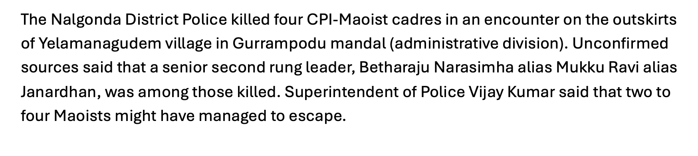
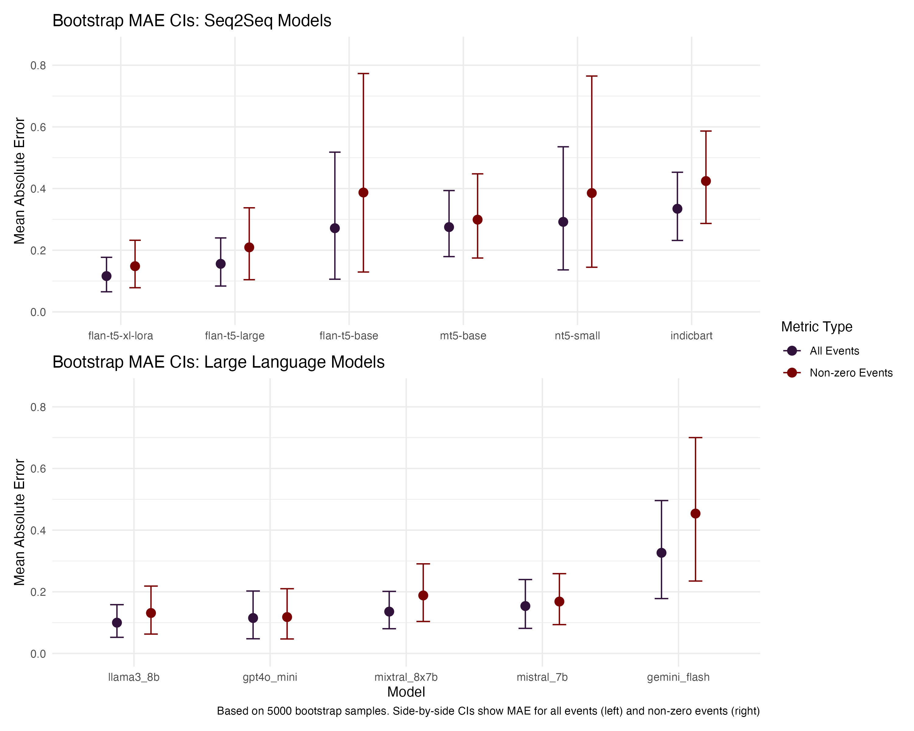
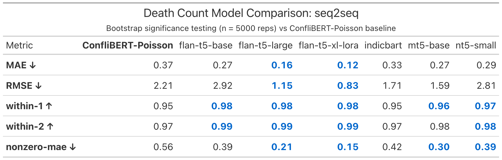
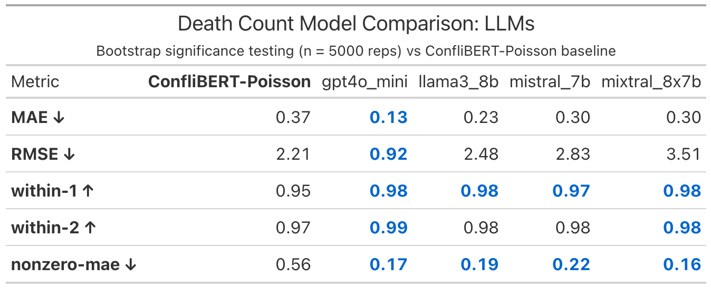
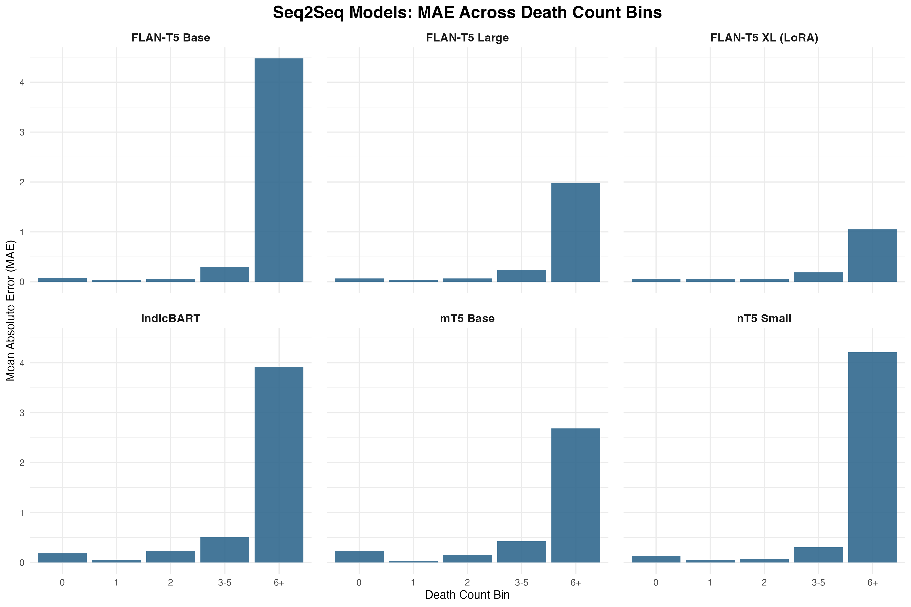
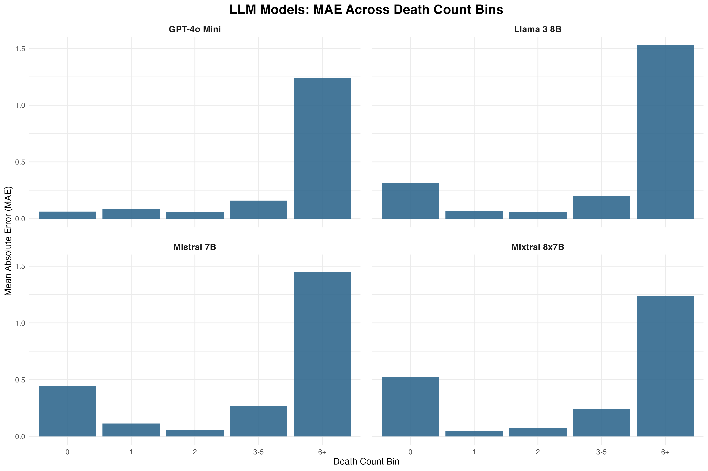

```{r}
#| label: setup
#| include: false

# Load necessary packages
library(ggplot2)
library(dplyr)
library(tidyr)
library(pROC)
library(knitr)
library(viridis)
library(readr)
library(here) 
library(janitor)
library(patchwork)

# Declare location of presentation
here::i_am("presentation.qmd")
```

## Overview

- Focus: Maoist insurgency in India 
- Data set of 10k hand-coded events from SATP over 2005-2016
- Charactersitic of bespoke datasets with niche labels and lexical complexity that we find in regional and conflict studies
- How much can autocode these events with low-cost open-source models?

## Data: South Asia Terrorism Portal (SATP)

- Focus: Maoist insurgency in India
- 10,000 hand-coded event summaries



## Counts and Locations

- 


## Sequence to Sequence (seq2seq) Models


## Protocols for Human Codings

- Grad student supervisor
- 4-6 undergrads coding in pairs
- Structured onboarding
- Supervised trials
- Events double-coded
- Regular meetings to adjudicate edge cases
- Discrepancies resolved by senior coders

## Research Questions

- To what extent can encoder models replace humans at our coding tasks?
- How many examples do you need for accurate codings? 
- How do encoders trade off in terms of speed and accuracy? 
- How best to deal with rare labels? 

## 



## 



## 



## 


##



## Comments?

:::{.columns}

::: {.column width="50%"}
Thank you! 🙏

<br>
<br>

We look forward to your feedback...
:::

::: {.column width="50%"}

:::

:::