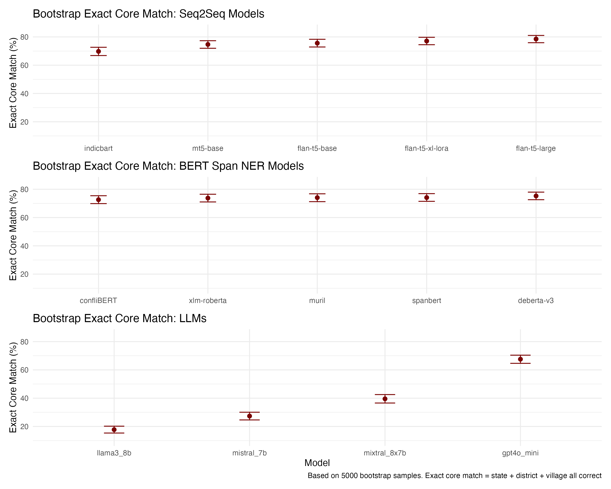
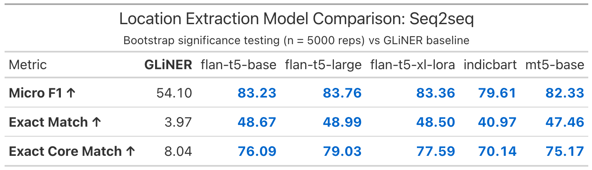
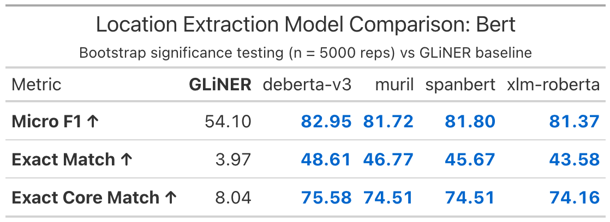
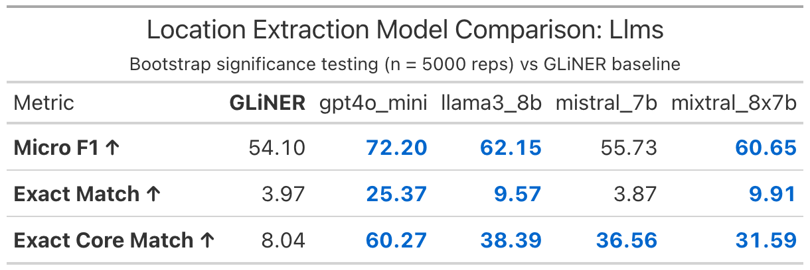
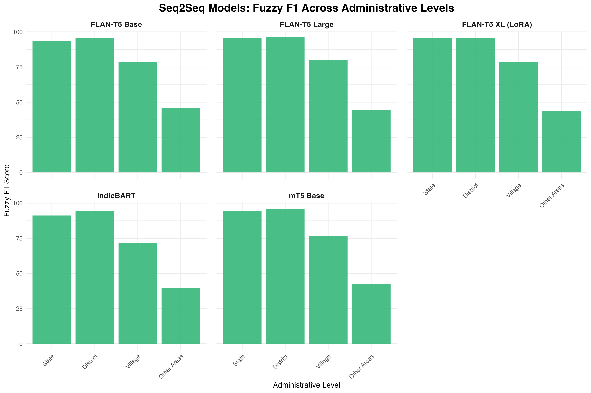
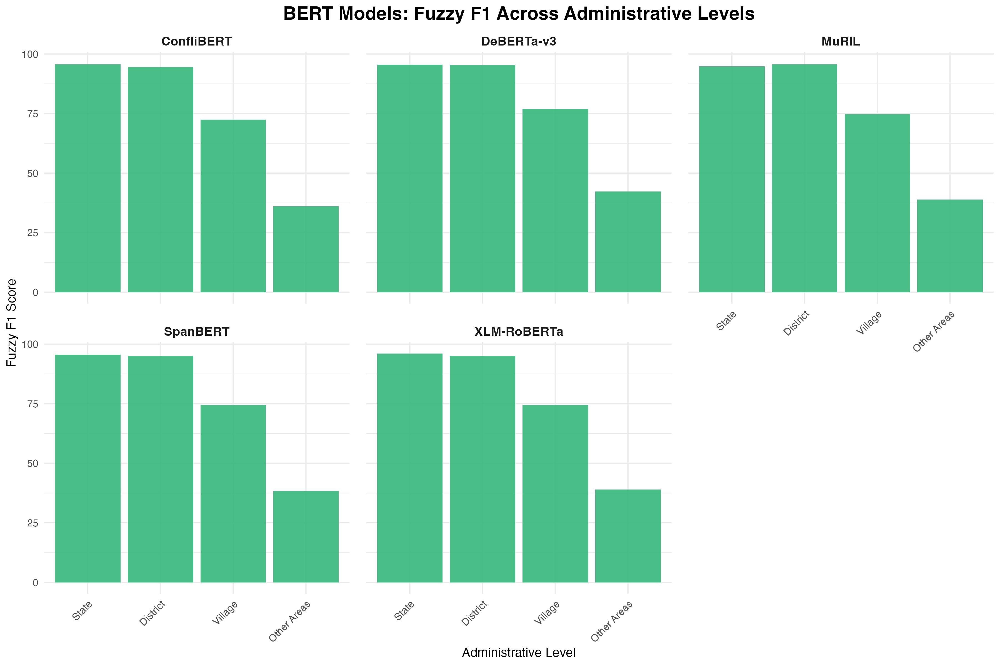
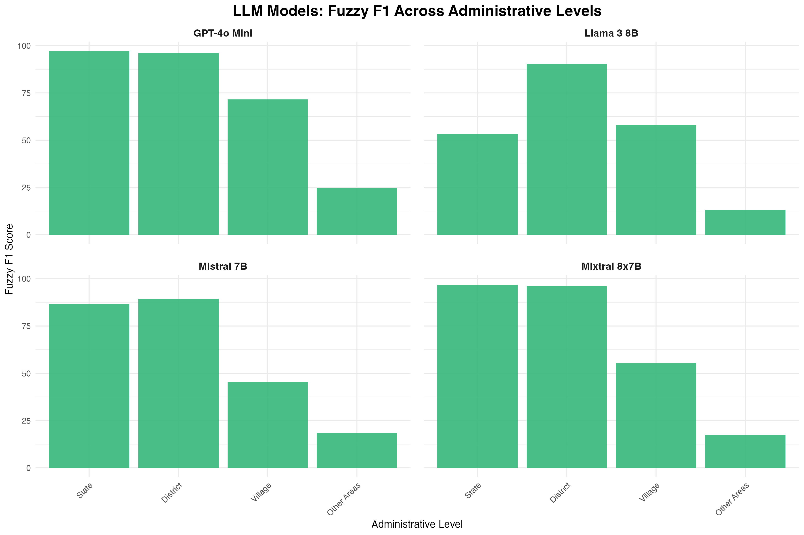
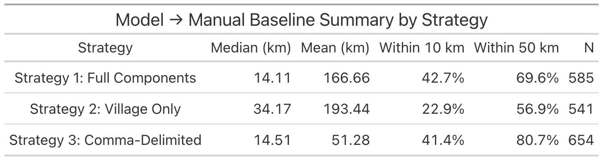
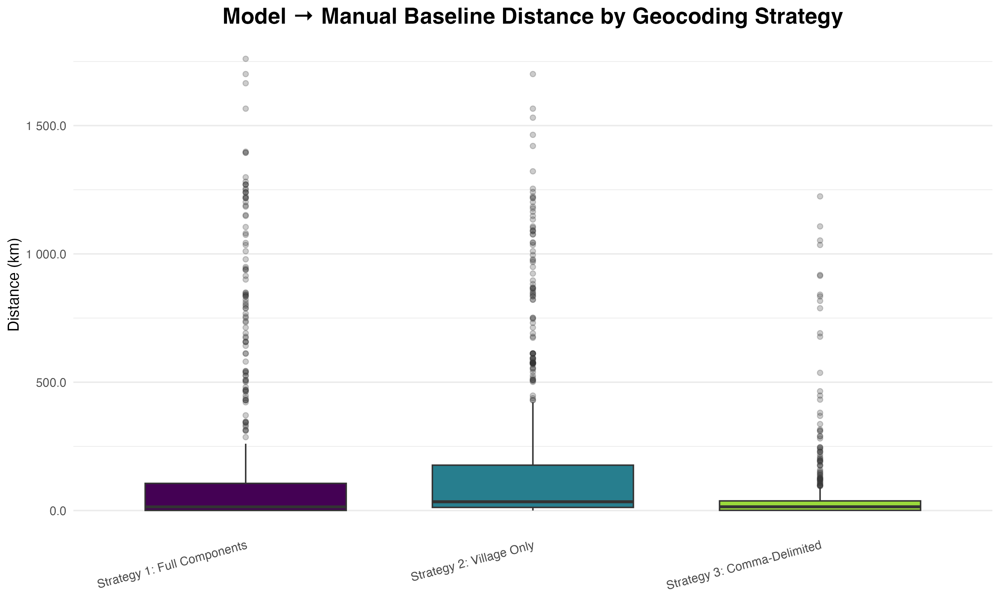

```{r}
#| label: setup
#| include: false

# Load necessary packages
library(ggplot2)
library(dplyr)
library(tidyr)
library(pROC)
library(knitr)
library(viridis)
library(readr)
library(here) 
library(janitor)
library(patchwork)

# Declare location of presentation
here::i_am("presentation.qmd")
```

## Overview

- Focus: Maoist insurgency in India 
- Data set of 10k hand-coded events from SATP over 2005-2016
- Charactersitic of bespoke datasets with niche labels and lexical complexity that we find in regional and conflict studies
- How much can autocode these events with low-cost and open-source models?

## Data: South Asia Terrorism Portal (SATP)

- Focus: Maoist insurgency in India
- 10,000 hand-coded event summaries


## Protocols for Human Codings

- Grad student supervisor
- 4-6 undergrads coding in pairs
- Structured onboarding
- Supervised trials
- Events double-coded
- Regular meetings to adjudicate edge cases
- Discrepancies resolved by senior coders

## Hire Bots Instead?

- Simple classification tasks (easy)
- Multiclass classification (also pretty easy)
- Multilabel classification (harder)
- Place names (challenging, OK with classical NER)
- Counts (not NER, not classification)
- Imbalanced data (yikes)

## Sequence to Sequence (seq2seq) Models

- Decoder only (BERT-based)
- Encoder only (modern LLMs like ChatGPT, Claude)
- Encoder-decoder (seq2seq)
  - Can read context and generate text
  - Best of both worlds? 

# Death Counts

## Models {.smaller}

- **seq2seq**
  - *T5 models--*Flan-T5 (base, large and XL)
  - *Specialized--*mt5 base, nt5 small, IndicBART
- **LLMs--**
  - *Open source--*Llam3-8b, Mixtral-8x7b, Mistral7b
  - *Proprietary--*ChatGPT-4o mini, Gemini Flash 2.5
- **Baseline--**ConfliBERT with a poisson head 

## Prompts

<br>

- **seq2seq--**How many people were killed? Answer with only a number.
- **LLMs--** "How many people were killed? Answer with only a number. "
    "Return JSON exactly as: {\"fatalities\": <integer>}. If no fatalities are mentioned, use 0."


## Train-Test Split

- Filter for violent events
- 60/20/20 split
- Weighted based on bins (0, 1, 2, 3-5, 6+)

## Metrics

- Mean absolute error (MAE)
- Root mean squared error (RMSE)
- Within 1 of actual count (within 1)
- Within 2 of actual count (within 2)
- Nonzero MAE

## 

{fig-align="center"}

## 

<br>

{fig-align="center"}

## 

<br>

{fig-align="center"}

## 

{fig-align="center"}
##


# Location Extraction

## Models {.smaller}

- **seq2seq**
  - *T5 models--*Flan-T5 (base, large and XL)
  - *Specialized--*mt5 base, nt5 small, IndicBART
- **Decoders for span NER--** 
  - *General--*XLM RoBERTa, deBERTa-v3 
  - *Specialized--*ConfliBERT, Muril, SpanBERT
- **LLMs--**
  - *Open source--*Llam3-8b, Mixtral-8x7b, Mistral7b
  - *Proprietary--*ChatGPT-4o mini, NO Gemini Flash 2.5
- **Baseline--**GLiNER 

## Span NER with a Decoder

- Use human annotations to identify span where location is mentioned
- Then extract the location
- "Silver label" spans used to train models

## Prompts {.smaller}

- **seq2seq**

| "Extract location hierarchy from incident: "
|  `f"{summary}\nFormat: state: <name>, district: <name>, "`
|  `"village: <name>, other_locations: <name>. "`
| "Use exact format with labels. Omit missing levels."

- **LLMs**

| "Extract the location hierarchy from this incident. "
| "Return exactly in format: state: <name>, district: <name>, village: <name>, other_locations: <name>. "
| "Use exact format with labels. Omit any missing administrative levels. "
| "Do not repeat the incident text; output only the structured fields. "
| "If no locations are mentioned, return an empty string."

## Train-Test Split

- 80/10/10 temporal split
- Reflects changes in geographic distribution over time
- Models real-world deployment

## Metrics

- Exact match F1 (per level)
- Micro exact match F1 (across levels)
- Exact match core areas (state, district, village)
- Exact match (all places)
- Fuzzy matches (usually @ 2 pts higher)

##

{fig-align="center"}

## 

<br>

{fig-align="center"}

## 

<br>

{fig-align="center"}

##

<br>

{fig-align="center"}

## 

{fig-align="center"}

##

{fig-align="center"}


## 

{fig-align="center"}

# Geocoding

## Google Geocoding API

<br>

- Fed locations from best model (Flan-T5-Large)
- Returned lat/long coordinates
- Compared to gold standard lat/long from SATP

## Strategies

<br>

- Constrained state, district plus village and other locations
- Constrained state, district plus only village
- Comma delimited list of all locations (no constraints)

## 

<br>

{fig-align="center"}

## 

{fig-align="center"}

## Comments?

:::{.columns}

::: {.column width="50%"}
Thank you! 🙏

<br>
<br>

We look forward to your feedback...
:::

::: {.column width="50%"}

:::

:::